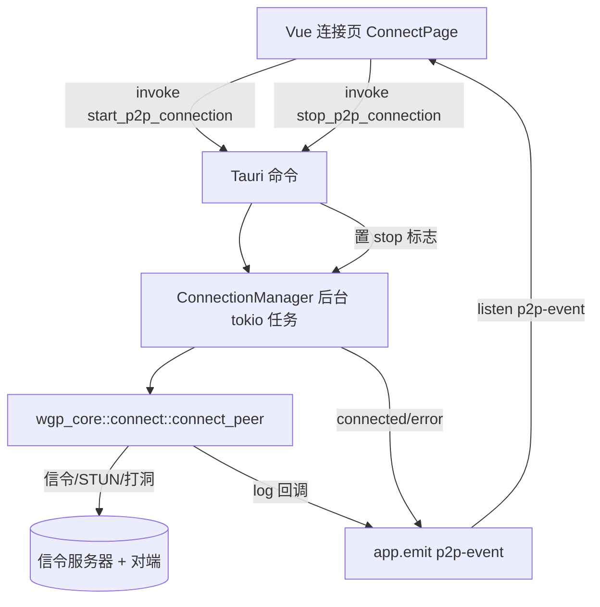

## 用户需求

改进 Tauri 应用的 Vue 前端联机界面，并将独立的联机核心 wgp-core 接入 Tauri 后端（src-tauri），使前端可通过 Tauri 命令驱动「创建/加入房间 + P2P 连接」的完整流程，取代旧的本地陶瓦(terracotta) HTTP 中转方案。UI 视觉与功能完整性兼顾。

## 产品概述

在桌面客户端内提供一套基于 wgp-core 折跃门 P2P 打洞协议的联机能力：用户输入邀请码、选择创建者/加入者角色并填写服务地址后，后端在独立 tokio 任务中执行 `connect_peer`（信令握手 → STUN 探测 → NAT 判定 → 打洞 → DSTE），并以事件流实时向前端推送连接阶段、日志与结果。前端呈现清晰的状态机与反馈。

## 核心功能

- 创建/加入房间：输入邀请码、选择角色，调用后端 P2P 连接。
- 连接过程实时反馈：阶段进度、日志时间线、NAT 类型/对端地址/成功层/耗时等结果展示。
- 开始/停止控制：连接中可停止，断开后回到空闲态。
- 高级参数覆盖：信令地址、STUN 地址、NAT 检测 STUN 列表、应用类型（默认 GameTcp），带合理默认值。
- 状态可视化：未连接/连接中/已连接/失败 状态徽章与明确错误提示。

## 技术栈

- 前端：Vue 3 + TypeScript + Element Plus（现有 `el-tabs`/`el-button` 等）+ Vite + `@tauri-apps/api`（现有 `invoke`/`listen`）。
- 后端：Rust + Tauri 2 + tokio（多线程运行时，默认满足 `connect_peer` 的 `spawn_blocking`/`timeout` 要求）。
- 联机引擎：新增 path 依赖 `wgp-core = { path = "../../Rust/mc-link-core/wgp-core" }`（位于独立目录的 Rust 工程）。

## 实现方案

### 高层策略

在 `src-tauri` 中以 path 方式引入 `wgp_core`，新增一个连接管理模块与命令文件，把 `wgp_core::connect::connect_peer` 封装为可在 tokio 任务中运行的后台连接；运行期间通过 `AppHandle::emit("p2p-event", payload)` 把阶段进度与结果推送给前端。前端 `connect.ts` 用 `invoke` 触发、用 `listen('p2p-event')` 订阅，并把事件映射为 Vue 响应式状态机，驱动连接页 UI。

### 关键技术决策

- **命令与事件分离**：`start_p2p_connection` 立即返回（后台任务 id/状态），进度通过事件流推送，避免 Tauri 命令长阻塞导致前端卡死；与现有 `start_terracotta_*` 的「启动即轮询」模式不同，新方案更符合实时反馈需求。
- **复用 wgp-core 的进度回调模式**：`connect_peer` 接受 `log: impl Fn(String)`，直接借鉴 `mc-link-gui` 的做法，把该闭包转发为 `app.emit`；同时复用其 `Arc<AtomicBool>` 停止标志模式实现停止。
- **连接句柄集中管理**：新增 `ConnectionManager`（托管于 Tauri `State`），保存当前 `stop: Arc<AtomicBool>` 与连接句柄/通道，供 `stop`/`status` 命令访问，并预留 `p2p_socket` 供后续端口转发扩展（本期不实现桥接）。
- **信令服务器**：`connect_peer` 需要兼容 wgp-core 信令协议的服务器（Tauri 工作区现有 central-server/relay 未实现该协议，搜索为 0 命中；wgp-core 自带 `signaling/server.rs`）。方案：信令地址可配置，默认指向外部测试服务器；开发联调时可运行 wgp-core 自带信令服务（见实现备注）。

### 性能与可靠性

- `connect_peer` 内含 STUN 探测、打洞轮次、spawn_blocking 等，可能持续数秒到数十秒；放在独立 tokio 任务，前端不阻塞。
- 事件推送频率受 `connect_peer` 内部 tracing 日志驱动，量级为每秒数次，前端用增量追加而非全量重渲染时间线，避免重渲染开销。
- 停止采用原子标志 + 任务退出后清理 `ConnectionManager`，避免句柄泄漏与重复连接。

## 实现备注（防回归）

- **依赖冲突校验**：添加 wgp-core 后需确认其与 Tauri 现有依赖（tokio/bytes/rand/thiserror/tracing/serde 等）版本一致；确认 `wgp_core` 库本身不强制引入 `eframe`（egui/eframe 仅为 `mc-link-gui` 成员依赖），否则需在 wgp-core 中将其设为可选 feature。
- **地址解析**：参考 `mc-link-gui` 的 `parse_addr`/`parse_stun_server_list`，在命令层把字符串解析为 `SocketAddr`（带默认端口回退），解析失败返回中文错误。
- **AppType 传递**：前端传字符串（如 `"GameTcp"`），后端用 `AppType::from_str`/匹配转换为 `wgp_core::protocol::AppType`，默认 `GameTcp`；Minecraft 联机即该类型。
- **向后兼容**：保留现有 `start_terracotta_*` 命令与 `terracotta_client.rs` 不删除，UI 默认走新 P2P 路径；避免无关重构。
- **日志安全**：事件 payload 仅含状态/日志文本与地址信息，不泄露 token/密钥；tracing 调试日志保持后端，不原样外泄大 payload。

## 架构设计



## 目录结构

```
src-tauri/
├── Cargo.toml                      # [MODIFY] 新增 wgp-core 跨目录 path 依赖；校验 tokio 等版本
├── src/
│   ├── lib.rs                      # [MODIFY] invoke_handler 注册 start/stop/status 命令；manage ConnectionManager
│   ├── commands/
│   │   ├── mod.rs                  # [MODIFY] 新增 pub(crate) mod connect; pub(crate) use connect::*;
│   │   └── connect.rs              # [NEW] 封装 connect_peer 为 Tauri 命令；log 闭包 emit p2p-event；stage/error 结构化事件
│   └── mgr/
│       └── connection.rs           # [NEW] ConnectionManager：保存 stop: Arc<AtomicBool> 与连接句柄/通道；提供 start/stop/status
src/
├── lib/
│   ├── api/
│   │   ├── connect.ts              # [NEW] 封装 invoke(start/stop/status) 与 listen('p2p-event')，暴露响应式状态
│   │   └── index.ts                # [MODIFY] 导出 connect 模块
└── components/connect/
    ├── ConnectPage.vue             # [MODIFY] 状态机驱动：idle/connecting/connected/failed/disconnected；绑定事件更新
    ├── FlashConnect.vue            # [MODIFY] 快速模式：邀请码 + 角色，调用新 API，开始/停止
    ├── GaojiConnect.vue            # [MODIFY] 高级模式：信令/STUN/NAT-STUN/应用类型参数与确认开始
    └── ConnectionStatus.vue        # [NEW] 复用状态徽章 + 阶段进度 + 日志时间线展示组件
```

## 关键代码结构（接口级）

```rust
// src-tauri/src/commands/connect.rs （接口示意，不含实现体）
#[derive(serde::Deserialize)]
pub struct StartP2PArgs {
    pub mode: String,            // "create" | "join"
    pub code: String,
    pub signaling_addr: String,
    pub stun_addr: String,
    pub nat_stun_servers: Vec<String>,
    pub app_type: Option<String>, // 默认 GameTcp
    pub listen_port: Option<u16>, // 本期可空，预留桥接
}

#[derive(serde::Serialize, Clone)]
pub struct P2PEvent {
    pub stage: String,        // "progress" | "connected" | "error" | "stopped"
    pub message: String,
    pub nat_type: Option<String>,
    pub peer_addr: Option<String>,
    pub success_layer: Option<String>,
    pub elapsed_ms: Option<u64>,
    pub error: Option<String>,
}

#[tauri::command] pub async fn start_p2p_connection(app: AppHandle, mgr: State<'_, ConnectionManager>, args: StartP2PArgs) -> Result<String, String>
#[tauri::command] pub fn stop_p2p_connection(mgr: State<'_, ConnectionManager>) -> Result<(), String>
#[tauri::command] pub fn get_p2p_status(mgr: State<'_, ConnectionManager>) -> ConnectionStatus
```

## 设计风格

在现有 Tauri 客户端设计系统（CSS 变量 `--accent-primary`/`--text-muted`/`--border-color`/`--sp-*`/`--fs-*`/`--motion-base`/`--ease`）基础上，采用现代、状态驱动、略带玻璃质感的连接体验。连接页以「状态英雄区 + 实时时间线」为核心，配合平滑过渡与微动效，使 P2P 连接的过程清晰、可信、可感知。

## 页面区块设计（连接页，自顶向下）

1. 顶部状态英雄区：大号状态徽章（未连接灰 / 连接中蓝并呼吸、已连接绿、失败红），下方一行当前角色与邀请码摘要；过渡使用淡入与位移。
2. 模式切换区：快速 / 高级标签页（沿用 el-tabs），快速模式仅邀请码 + 创建/加入切换；高级模式展开信令、STUN、NAT-STUN、应用类型表单。
3. 控制区：开始联机 / 停止 主按钮，连接中显示加载与可中断停止；按钮带 hover 抬升与点击反馈。
4. 结果卡片（已连接时）：对端地址、本地/对端 NAT 类型、成功层（Direct/Tunnel/Encode）、耗时；以指标卡网格呈现。
5. 实时日志时间线：等宽字体、按阶段分色（信息/成功/警告/错误），新条目滑入并自动滚动到底；连接失败时高亮错误条目。
6. 底部错误与帮助：失败态展示明确中文错误与可能原因（如信令不可达、UDP 被阻、对称 NAT）。